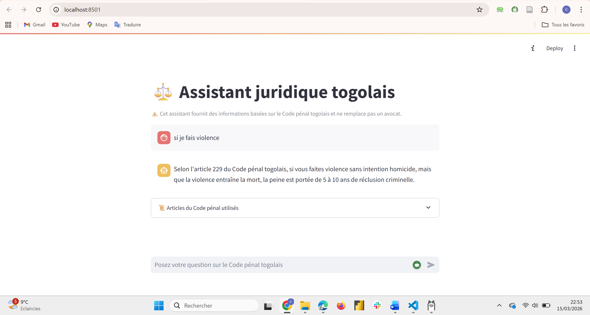

# ⚖️ Assistant juridique togolais (RAG)

Application d'IA générative permettant d'interroger le Code pénal togolais à l'aide d'une architecture RAG (Retrieval-Augmented Generation).

## Fonctionnalités

- interrogation du Code pénal togolais
- recherche d’articles pertinents avec FAISS
- génération de réponses juridiques avec LLM (Ollama en local)
- interface chatbot avec Streamlit

## Technologies

- Python
- FAISS
- SentenceTransformers
- Ollama (Llama3)
- Streamlit

## Architecture

RAG Pipeline :

Question → Embeddings → FAISS → Articles → LLM → Réponse

## Interface de l'application

